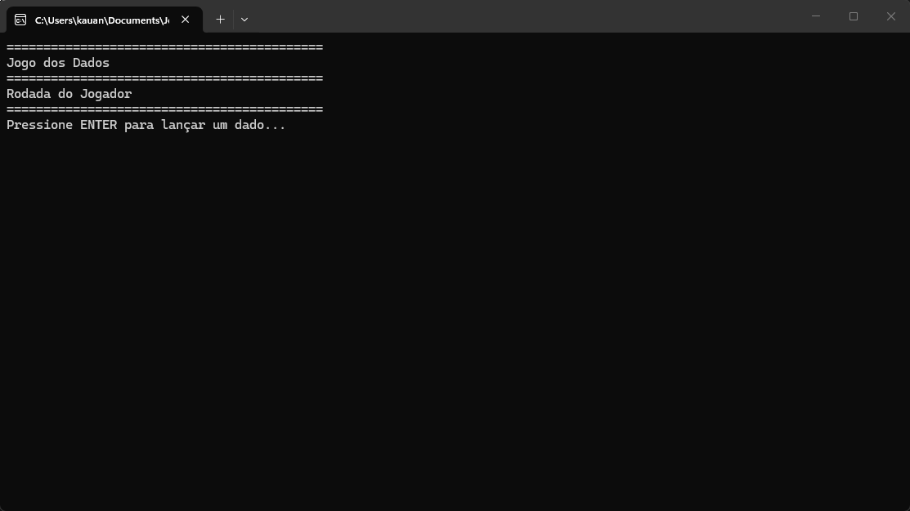

# Corrida De Dados (Console)

A Corrida de dados e um jogo em console que simula uma corrida de dados contra um bot, onde quem chegar a o 30 primeiro girando os dados vence!, o jogo foi desenvolvido em C# na Academia do Programador Fullstack.

## Como jogar?

1. Clone o repositório ou baixe o código comprimido em .zip.
2. Abra o emulador de terminal e navegue até a pasta raiz.
3. Utilize o comando abaixo para restaurar as dependências do projeto.

   ```
   dotnet restore
   ```

4. Em seguida compile e execute o projeto com o comando:

   ```
   dotnet run --project JogoDeDados.ConsoleApp
   ```

## Requisitos

- .NET SDK 10.0+


